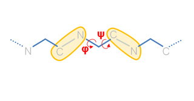

### How are defined Coarse Grained (CG) levels?

The coarse-graining model representation determines both the system mass distribution and the springs network. The available Coarse-Graining models for <b>proteins</b> are listed below:

<table bgcolor="#f00000"border="2" cellspacing="4" cellpadding="2">
<tbody>
<tr>
<td width="252px"></td>
<td width="300px" bgcolor="#f0f0f0"><b>Cα</b> (−m 0)  Only Cα atoms accounting for whole residue mase are considered. This CG model has two extra atoms per chain, one N atom at the beginning and one C atom at the end.</td>
</tr>
<tr>
<td width="252px"></td>
<td width="300px"  bgcolor="#f0f0f0"><b>3BB2R</b> (−m 1)  There are five atoms per residue. Three represent the backbone: N, Cα and carbonylic C; and two represent the side chains: Cβ and a pseudo-atom (R) placed on the center of mass of the remaining side chain atoms. Note that Glycine and Alanine will be modeled by 3 and 4 atoms,respectively.</td>
</tr>
<tr>
<td width="252px" ></td>
<td width="300px"  bgcolor="#f0f0f0"><b>Full-atom</b> (−m 2, <i><b>default</b></i>)  All heavy atoms are considered, each one accounting for its mass.</td>
</tr>
</tbody>
</table>

Next figures illustrate the appearance of the Cα and 3BB2R CG models:

<table class="text" style="width: 480px;" border="0" cellspacing="4" cellpadding="2">
<tbody>
<tr>
<td align="center"><b>Cα-model</b></td>
<td align="center"><b>3BB2R-model</b></td>
</tr>
<tr>
<td></td>
<td></td>
</tr>
</tbody>
</table>
On the left model only Cα atoms (yellow) are considered. On the right, the 3BB2R model (right) have five atoms per residue: three representing the backbone (N, Cα and carbonylic C, in blue, yellow and cyan, respectively), and two representing the side chains (Cβ and a pseudo-atom placed on the center of mass of the remaining side chain, in cyan and red, respectively). 
At this moment, only the Full-atom representation is available for <b>nucleic acids</b>:

<table class="text" style="width: 480px;" border="0" cellspacing="4" cellpadding="2">
<tbody>
<tr>
<td align="center"><b>RNA</b></td>
<td align="center"><b>DNA</b></td>
</tr>
<tr>
<td></td>
<td></td>
</tr>
</tbody>
</table>

</td>
</tr>
</tbody>
</table>

### How to use CG models?

To choose the desired CG model -m option must be added to the basic command followed by model identifier. The basename option (-o) will be used to avoid overwriting of previous re.

Ca       -&gt; imode 1ab3.pdb -m 0 -o imodeCA   3BB2R-&gt; imode 1ab3.pdb -m 1 -o imode3BB2R

You can check the CG models using Jmol: <a style="background-color: #dbe5f8;" title="Click here to view in Jmol" href="http://chaconlab.org/">  Ca model</a> and <a style="background-color: #dbe5f8;" title="Click here to view in Jmol" href="http://chaconlab.org/">  3BB2R model</a>.

In <b>Ca</b> case, an extra file is produced: <b>imodeCA_ncac.pdb</b>. This PDB file is just a standard PDB containing the coordinates of backbone nitrogen (N), and alpha (Ca) and carbonylic carbons (C), i.e. those atoms needed to define the f and ? dihedral angles. This is the <b>minimum required structure to use our Ca model</b>. A structure with only Ca atoms will not work. In this case, external software to generate backbone N and C atoms is mandatory. For example, you can use the online server: <a href="http://bioserv.rpbs.univ-paris-diderot.fr/cgi-bin/SABBAC">SABBAC</a>.

To animate these modes, the CG model introduced to iMOVE should be the same used in iMODE:

Ca       -&gt; imove imodeCA_ncac.pdb imodeCA_ic.evec imoveCA_1.pdb 1 -m 0 -a 0.4  3BB2R-&gt; imove 1ab3.pdb imode3BB2R_ic.evec imove3BB2R_1.pdb 1 -m 1

In Ca case there are less springs than in full-atom. Thus, the amplitude was lowered (-a 0.4). In 3BB2R case, it is not necessary such modification since the number of springs is similar to full-atom.

Its convenient to convert CG models to a full atom representation to avoid problems of compatibility with visualization software:

Ca       -&gt;  imove 1ab3.pdb imodeCA_ic.evec imoveCA_FULL_1.pdb 1 -m 0 -a 0.4 --model_out 2   3BB2R-&gt;  imove 1ab3.pdb imode3BB2R_ic.evec imove3BB2R_FULL_1.pdb 1 -m 1 --model_out 2

An extra output file named <b>&lt;basename&gt;_icf.evec</b> will contain the output modes of the corresponding CG level.

### How to customize the potential energy model?

For a given structure and CG model, normal modes are determined by its potential energy, i.e. the spring network. In iMODE the potential energy can be customized in several ways 1) by distance-dependant functions 2) by topology and SS 3) by using custom potential.

#### Distance dependant functions

<table class="text" style="width: 670px;" border="2" cellspacing="4" cellpadding="2">
<tbody>
<tr>
<td width="220"><b>Functions</b></td>
<td width="80"><b>Options*</b></td>
<td width="300"><b>Description</b></td>
</tr>
<tr>
<td bgcolor="#f8f8f8" width="220">Inverse exponential (default)  K = k/(1+(x/x0)^p),  if x &lt; c, else K=0</td>
<td bgcolor="#f9f9f9"><b>-P 0</b> --k0_c 10 --k0_k 1 --k0_x0 3.8 --k0_p 6</td>
<td bgcolor="#f9f9f9"> Distance cutoff (Å) Scale factor Inverse exponential center Power term</td>
</tr>
<tr>
<td bgcolor="#f8f8f8">Simple distance cutoff  K = k,  if x &lt; c, else K=0</td>
<td bgcolor="#f9f9f9"><b>-P 1</b> --k1_c 10 --k1_k 1</td>
<td bgcolor="#f9f9f9"> Distance cutoff (Å)  Scale factor</td>
</tr>
</tbody>
</table>

<i>*Bold options are mandatory.</i>

For example, to use a Ca model with potential energy based on distance dependant functions, type:

imode 1ab3.pdb -m 0 -P 0 -o imodeCA_IE  imode 1ab3.pdb -m 0 -P 1 -o imodeCA_C

The appearance of this potential energy models with default parameters is shown below. Springs are represented by red segments with thickness proportional to the force constant.

<table class="text" style="width: 670px;" border="0" cellspacing="4" cellpadding="2">
<tbody>
<tr>
<td align="center"><b>Inverse exponential</b> (Stiffness inversely proportional to distance)</td>
<td align="center"><b>Simple distance cutoff</b> (Constant stiffness)</td>
</tr>
<tr>
<td></td>
<td></td>
</tr>
</tbody>
</table>

To customize the potential energy functions modify the default options; for example:

imode 1ab3.pdb -m 0 -P 0 --k0_c 8 --k0_k 2 -k0_x0 2.5 -k0_p 4 -o imodeCA_IE2  imode 1ab3.pdb -m 0 -P 1 --k1_c 5 --k1_k 2 -o imodeCA_C2

 Topology and Secondary Structure

iMODE permits the specification of customized inverse exponential functions according to both topology and SS.

The basic command for topology and SS would be:

imode 1ab3.pdb -P 2 --func funcTSS.txt -o imodeTSS

A functions file (<a href="media/files/funcTSS.txt">funcTSS.txt</a>) is mandatory. It should conform the following format: (Note, "#"-begining lines will be omitted)

<pre># SS  n  k  x0 p
HH    0  2 3.8 6
HH    1  5 3.8 6
HH    2  3 3.8 6
HH   -1  2 3.8 6
EE    0  2 3.8 6
EE    1  5 3.8 6
EE    2  3 3.8 6
EE   -1  5 3.8 6
XX   -1  1 3.8 6
</pre>

Each line represents an inverse exponential function. First column specifies the SS. For example, "HH" indicates that both atoms should belong to residues with a-helix SS. By default SS identifiers are: "H" helix, "E" strand, and "C" coil; and any pair of them is allowed. Second column specifies the topology. Here topology represents the sequential distance between two residues; for example, if our protein sequence were ...AGKTLV..., the topology between underlined residues would be 3. Remaining columns define the inverse exponential functional parameters: k, x0 and p, (see the table above).

The wildcards for SS and topology are "XX" and "-1", respectively.

By default, the SS is computed internally, but any user defined SS can be provided using the --ss option:

imode 1ab3.pdb -P 2 --func funcTSS.txt --ss 1ab3.ss -o imodeTSSE

For example, you can use DSSP to compute SS (<a href="files/1ab3.dssp">1ab3.dssp</a>) and with the aid of <a href="files/dssp2ss.pl">this</a> simple perl script you can convert it into our SS file format (<a href="files/1ab3.ss">1ab3.ss</a>)

perl dssp2ss.pl 1ab3.dssp 1ab3.ss

Our SS file format (<a href="files/1ab3.ss">1ab3.ss</a>) is a simple two column ASCII file. The first column corresponds to the sequence index, and the second one to a single-character SS identifier.  

Customize potential energy by topology only.

The basic command for topology is:

imode 1ab3.pdb -P 2 --func funcTOP.txt -o imodeTOP

The topology functions file (<a href="media/files/funcTOP.txt">funcTOP.txt</a>) is:

<pre># SS  n  k  x0 p
XX    0  2 3.8 6
XX    1  9 3.8 6
XX    2  5 3.8 6
XX    3  3 3.8 6
XX    4  2 3.8 6
XX   -1  1 3.8 6
</pre>

Customize potential energy by SS only.

The command to take into account SS only would look like this way:

imode 1ab3.pdb -P 2 --func funcHE.txt -o imodeHE

The functions file (<a href="media/files/funcHE.txt">funcHE.txt</a>) is:

<pre># SS (j-i) k  x0 p
HH     -1  2 3.8 6
EE     -1  5 3.8 6
HE     -1  3 3.8 6
XX     -1  1 3.8 6
</pre>

This file applies different functions to atom pairs belonging to residues with SS: H vs. H (HH), E vs. E (EE) and H vs. E (HE). The XX function will be applied to remaining pairs of atoms.

Given the non-Helical or non-Sheet regions are more flexible than the rest, sometimes may be interesting to increase flexibility in those regions. The corresponding command would be:

imode 1ab3.pdb -P 2 --func funcCX.txt -o imodeCX

The functions file (<a href="media/files/funcCX.txt">funcCX.txt</a>) is:

<pre># SS (j-i)   k  x0 p
CC     -1  0.2 3.8 6
XX     -1    1 3.8 6
</pre>

The springs associated to the last example are represented below. First and second function springs are colored in orange and red, respectively. For clarity, both kinds of springs were shown with similar thicknesses.

<table class="text" style="width: 670px;" border="0" cellspacing="4" cellpadding="2">
<tbody>
<tr>
<td align="center"></td>
</tr>
</tbody>
</table>

--------------- User custom potential. ---------------

The user can define its potential thought a file using the -K option. Type at the command prompt:

imode 1ab3.pdb -K imodeKi_Kfile.dat -o imodeCP

This ASCII file (<a href="media/files/imodeKi_Kfile.dat">imodeKi_Kfile.dat</a>) has three columns to define the force constants (K) for each atomic pair:

<pre>1 2 9.962940E-01
1 3 9.292819E-01
1 4 6.086772E-01
1 5 9.329874E-01
1 6 8.701856E-01
...........
</pre>

Each line represents one spring. The first and second colums are the atomic indices (begining with 1), and the third is the force constant.

To obtain a Kfile template for your macromolecule that you can adapt to your convenience, use:

imode 1ab3.pdb -P 1 --k1_c 10 --save_Kfile -o imodeKc

The resulting file, <b><a href="media/files/imodeKc_Kfile.dat">imodeKc_Kfile.dat</a></b>, will contain the force constants for current potential energy model, in this case, the simple cutoff model.

### How to deal with huge systems?

In iMOD, the maximum macromolecular size allowed to perform NMA is constrained by the amount of memory needed to diagonalize the Hessian matrix, and it depends on the employed architecture. For example, in a standard 32-bit linux box (the maximum memory addressed per program is about 2Gb) so it can solve systems up to approximately 15000 degrees of freedom (DoF), i.e. about 7000-8000 amino acids in proteins or 3000 nucleotides in nucleic acids. On the other hand, 64-bit machines are only limited by available RAM. For example, NMA of a 50000 DoFs system would need a 64-bit computer with about 30Gb of RAM memory. Therefore a dimensionality reduction is mandatory when the system under study becomes huge for standard computers. To this end, we can fix some internal coordinates (ICs)  to reduce the number of degrees of freedom and fit the matrices into memory. There are three ways to accomplish this:
<ul>
<li>Fixing custom ICs.</li>
<li>Fixing by secondary structure</li>
<li>Fixing ICs randomly.</li>
</ul>
Here we are going to comment on the simplest way to reduce the dimensionality, which is to fix randomly some ratio of dihedral angles. Other possibilities to fix IC will be discussed in the next section.  <b>Fixing ICs randomly</b> For fixing randomly some ratio of dihedral angles, just type:

imode 1aon.pdb -r 0.5 -o imodeR05

This will fix the 50% of available dihedral angles. Note the inter-chain rotational/translational degrees of freedom are always maintained mobile. To illustrate this reductionist approach we propose the following practical examples with a HUGE viral system:
<ul>
<li><a href="#FAQ_CCMV_NMA">NMA of the closed CCMV capsid</a></li>
<li><a href="#FAQ_CCMV_MORPH">Morphing the closed CCMV capsid into the swollen form</a></li>
</ul>
NMA of the closed CCMV capsid
The capsid of the Cowpea Chlorotic Mottle Virus (CCMV) is a huge protein structure composed of 180 chains, 28620 amino acids and 214440 atoms. In terms of ICs it means about 58000 ICs: 56994 dihedral angles (f and ?) and 1074 inter-chain rotational/translational variables. Performing NMA with 58000 ICs it's impractical in standard PC box, since there would be needed a 64-bit computer with about 30Gb of RAM, and each diagonalization step would last even days. To overcome this we are going to fix the 90% of dihedral angles while keeping mobile all rotational/translational degrees of freedom:

imode <a href="media/files/1cwp_prot.pdb.gz">1cwp_prot.pdb</a> -o 1cwpDH09 -r 0.9 --save_fixfile

<pre>imode&gt;
imode&gt; Welcome to the NMA in Internal Coordinates tool v1.10
imode&gt;
imode&gt; Reading PDB file: 1cwp_prot.pdb
molinf&gt; Protein   1 chain  1 A segment  1 residues: 149 atoms: 1122
molinf&gt;                    2 B segment  1 residues: 164 atoms: 1226
molinf&gt;                    3 C segment  1 residues: 164 atoms: 1226
molinf&gt; Protein   2 chain  1 A segment  1 residues: 149 atoms: 1122
...................................................................
molinf&gt; Protein  60 chain  1 A segment  1 residues: 149 atoms: 1122
molinf&gt;                    2 B segment  1 residues: 164 atoms: 1226
molinf&gt;                    3 C segment  1 residues: 164 atoms: 1226
molinf&gt; SUMMARY:
molinf&gt; Number of Molecules ... 60
molinf&gt; Number of Chain ....... 180
molinf&gt; Number of Segments .... 180
molinf&gt; Number of Groups ...... 28620
molinf&gt; Number of Atoms ....... 214440
molinf&gt;
imode&gt; Coarse-Graining model: Full-Atom (no coarse-graining)
imode&gt; Selected model residues: 28620
imode&gt; Selected model (pseudo)atoms: 214440
imode&gt; Number of Dihedral angles: 55920
imode&gt; Number of Inter-segment coords: 1074 (Rot+Trans)
imode&gt; Number of Internal Coordinates: 56994 (Hessian rank)
imode&gt; Input CG-model Fixed Internal Coordinates: 50328
imode&gt; Input CG-model Final Internal Coordinates (sizei) = 6666
imode&gt; Range of computed modes: 1-20
imode&gt; Creating pairwise interaction potential:
imode&gt; Inverse Exponential (16245240 nipas) cutoff= 10.0, k= 1.000000, x0= 3.8
imode&gt; Packed-Hessian/Kinetic matrices mem.= 177.769 Mb (rank= 6666)
imode&gt; Fast Hessian Matrix Building O(n^2) [hessianMFAx()] 17.24 sec
imode&gt; Fast Kinetic-Energy matrix Building O(n^2) [kineticMFAx()] 20.34 sec
imode&gt; Eigenvector matrix mem. = 1.067 Mb
imode&gt; Diagonalization with XSPGVX()... 380.06 sec
imode&gt; Showing the first 10 eigenvalues:
imode&gt;
imode&gt; MODE   EIGENVALUE
imode&gt;    1  1.72062e-04
imode&gt;    2  1.75517e-04
imode&gt;    3  1.77022e-04
imode&gt;    4  1.79158e-04
imode&gt;    5  1.81447e-04
imode&gt;    6  3.30420e-04
imode&gt;    7  3.39147e-04
imode&gt;    8  3.44462e-04
imode&gt;    9  3.57581e-04
imode&gt;   10  3.65270e-04
imode&gt;
imode&gt;
imode&gt; SAVED FILES:
imode&gt; Log file:                                                   1cwpDH09.log
imode&gt; Model PDB:                                            1cwpDH09_model.pdb
imode&gt; Fixation mask file:                                         1cwpDH09.fix
imode&gt; ICS eigenvectors:                                       1cwpDH09_ic.evec
imode&gt;
imode&gt; Bye!
</pre>
This way, only 6666 ICs were considered. Below you can check 5th and 18th normal modes, from the H and A and irreducible representations, respectively. On the left, the flash movies, on the left the displacement vectors.
<table border="0" cellspacing="0" cellpadding="0" align="center">
<tbody>
<tr>
<td><video controls="controls" width="320" height="259">
  <source src="images/video/imod/1cwpDH09_5.mp4" type="video/mp4" />
  Your browser does not support HTML5 video.
  </video></td>
<td></td>
</tr>
<tr>
<td><video controls="controls" width="320" height="259">
  <source src="images/video/imod/1cwpDH09_18.mp4" type="video/mp4" />
  Your browser does not support HTML5 video.
  </video></td>
<td></td>
</tr>
</tbody>
</table>
Morphing the Closed CCMV capsid into the swollen form To illustrate iMORPH's performance on a huge system we are going to compute a feasible trajectory from the <a href="media/files/1cwp_prot.pdb.gz">closed</a> into the <a href="media/files/ccmv_swln_1_full.vdb.gz">swollen</a> structure. This "swelling", represents a huge concerted motion about 24.0 Å Ca RMSD where 2nm sized openings appear in the protein shell. Both structures were obtained from <a href="http://viperdb.scripps.edu/"> V IPERdb</a> and are shown below.
<table border="0" cellspacing="0" cellpadding="0" align="center">
<tbody>
<tr>
<td></td>
<td></td>
</tr>
</tbody>
</table>
As a consequence of both motion and system size we had to carry it out in two steps using some extra options: imorph 1cwp_prot.pdb ccmv_swln_1_full.vdb -i 200000 -r 1 -e 0.05 --morepdbs --nowrmsd -o ccmvmorph  imorph ccmvmorph_fitted.pdb ccmv_swln_1_full.vdb -i 300000 -r 1 -n 0.99999 --morepdbs --prob plain -o ccmvmorph2 In first step we added: -e 0.05 to speed up convergence, --nowrmsd to disable the Weighted-RMSD alingment (which is not suited to huge motions), and --more_pdbs to force saving the fitted structure. Note this fitted structure was still about 5 Å Ca RMSD away from the target. In a second refinement step, we used all available modes (-n 0.99999) with a different mode selection scheme (--prob plain). Since we were closer to the target structure, the --nowrmsd option was removed. Note that to minimize NMA time in both steps only the rotational/translational ICs were considered (-r 1). Now a successful morphing <a href="media/files/ccmvmorph2_fitted.pdb.gz">result</a> is obtained. It's only 0.95 Å Ca RMSD from the target structure. You can check out its beautiful movie below.

<video controls="controls" width="320" height="259">
  <source src="images/video/imod/ccmvmorph_movie.mp4" type="video/mp4" />
  Your browser does not support HTML5 video.
  </video>

  
### How to fix ICs?

To reduce the dimensionality of the problem With iMOD you can fix in many ways the internal coordinate variables :
<ul>
<li>Randomly (commented before Q4) </li>
<li><a href="#FIX_X">Un-fix χ dihedral angle.</a></li>
<li><a href="#FIX_SS">By Secondary Structure.</a></li>
<li><a href="#FIX_IC">Customized  IC subset.</a></li>
</ul>

Un-fix any χ dihedral angle

Our Internal Coordinates are φ, ψ and χ dihedral angles for proteins, and α, β, γ, ε, ζ and χ for nucleic acids (see figure below). Another six additional rotational/translational degrees of freedom are added every extra chain

<table class="text" style="width: 480px;" border="0" cellspacing="4" cellpadding="2">
<tbody>
<tr>
<td align="center"><b>Protein</b></td>
<td align="center"><b>RNA</b></td>
</tr>
<tr>
<td width="320"></td>
<td></td>
</tr>
</tbody>
</table>

By default we consider all but χ. The removal of these angles does not affect the low energy modes and will reduce the problem dimensionality by around 1/2 in proteins and 1/5 in nucleic acids.

imode 1ab3.pdb -x -o imodeX

By secondary structure

With iMOd you can fix the ICs depending on the secondary structure SS it belongs to. This can be done using the −−ss option followed by a letter identifier (H for helix, E for beta strands and C for others). Note you may fix any combination of SS by adding an identifier as you need; for example, "−S EC" will fix beta and coil. To fix all ICs related to α-helices and β-sheets, just type prompt:

imode 1ab3.pdb -S HE --save_fixfile -o imodeHE

By default, the SS is computed internally, but any user can define it own SS through a file and using the −−ss option:

imode 1ab3.pdb -P 2 --func funcTSS.txt --ss 1ab3.ss -o imodeTSSE

For example, you can use DSSP to compute SS (<a href="files/1ab3.dssp">1ab3.dssp</a>) and with the aid of <a href="files/dssp2ss.pl">this</a> simple Perl script you can convert it into our SS file format (<a href="files/1ab3.ss">1ab3.ss</a>)

perl dssp2ss.pl 1ab3.dssp 1ab3.ss

Our SS file format (<a href="files/1ab3.ss">1ab3.ss</a>) is a simple two column ASCII file. The first column corresponds to the sequence index, and the second one to a single-character SS identifier.  

<b>Fixing custom ICs</b>

Finally, you can fix any domain/s or region/s of your macromolecular structure. Any IC set can be considered fixed using the −f option with a mask file as;

imode 1aon.pdb -f imodeFIX.fix -o imodeFIXED

where the mask file <b>imodeFIX.fix</b> is an ASCII file with four columns. The first column is the residue index (beginning with 0), and the rest represents the φ, ψ and χ dihedral angles, respectively. In the nucleic acid case, the file will have seven columns instead of four,  to account for the (six) α, β, γ, ε, ζ and χ dihedral angles.

A dummy mask (fully mobile) can be obtained using the −−save_fixfile option in iMODE program.

imode 1aon.pdb --save_fixfile -o imodeFIX

such mask looks like:

<pre>0 0 0 1 1 1 0 1 ......... 276 1 0 1 277 0 0 1 278 1 0 1 ......... 522 1 0 1 523 0 0 1</pre>

To customize just change "1" by "0" for fixing ICs, save it, and use with imode with −f option to load it and restrict the NMA only with the non-fixed ICs as variables.

The extra zeros at some lines account for residues lacking corresponding ICs, i.e. Glycines and Alanines (no χ), and Prolines (no φ and χ). Note that the −x option must be added on previous commands if you plan to keep mobile some χ dihedral angles. If the macromolecule had several chains, six inter-chain rotational/translational ICs are added: three x, y, and z translations and three rotations around x, y and z axis, respectively. For example, if there is a new chain after residue 187 (index 186) the mask file will be:

<pre>......... 186 1 0 1 187 1 187 1 187 1 187 1 187 1 187 1 187 1 0 1 .........</pre>

